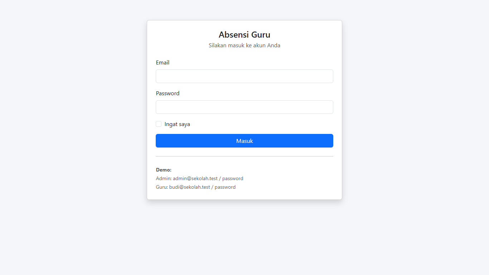
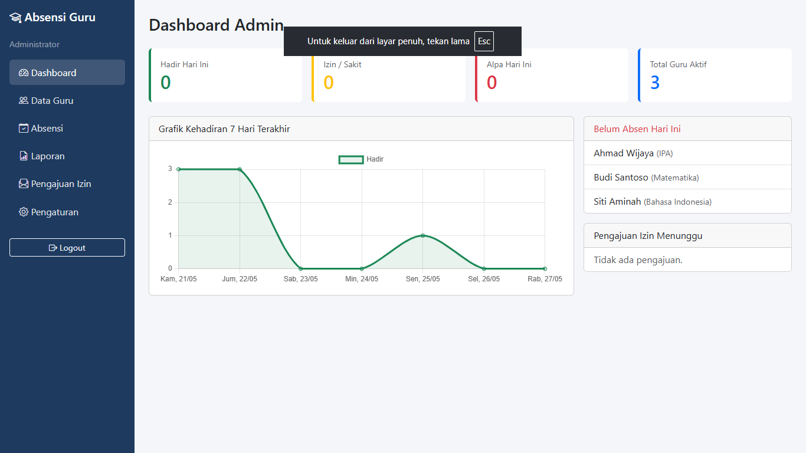
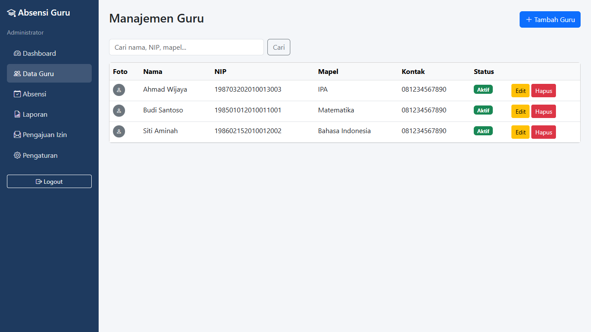
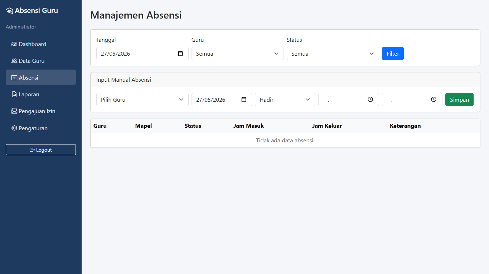
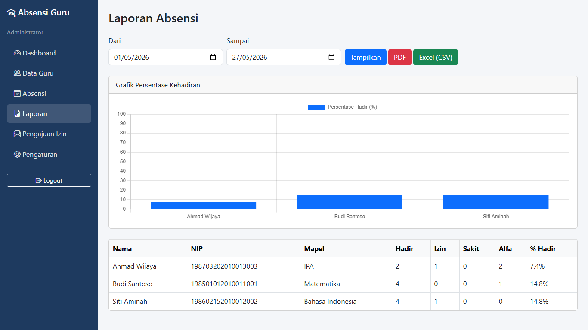
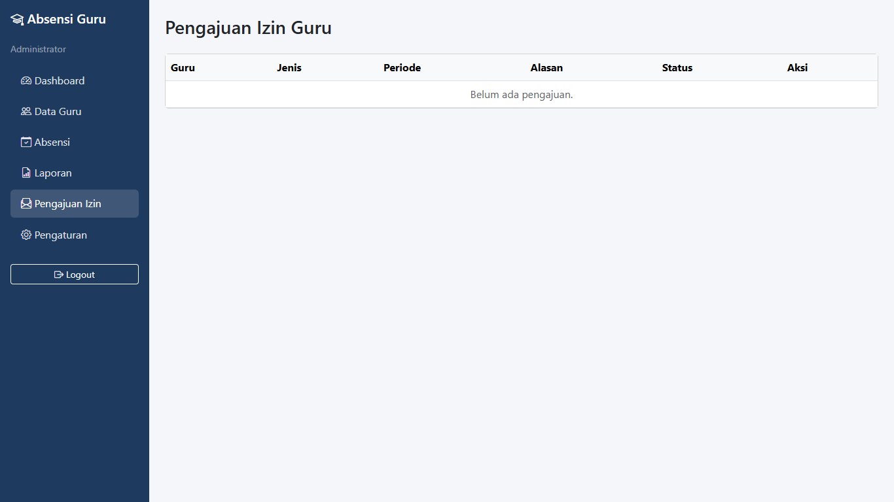
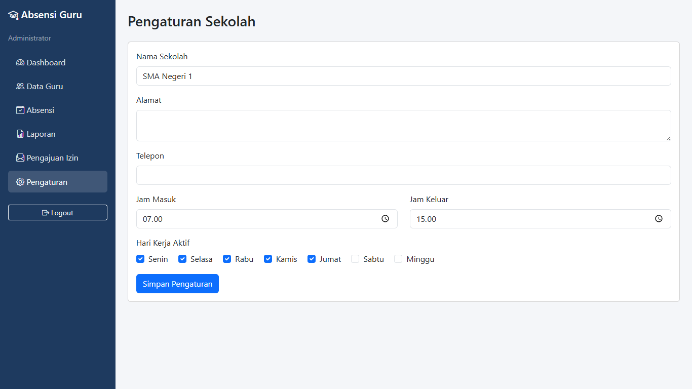
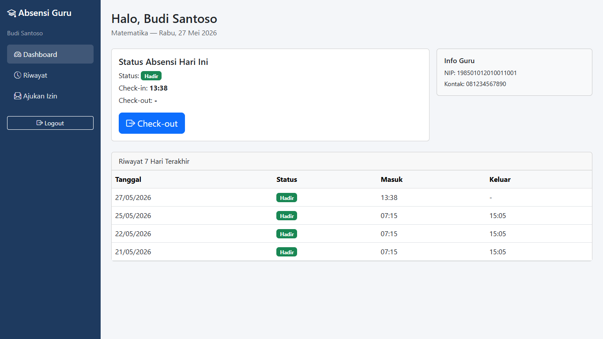
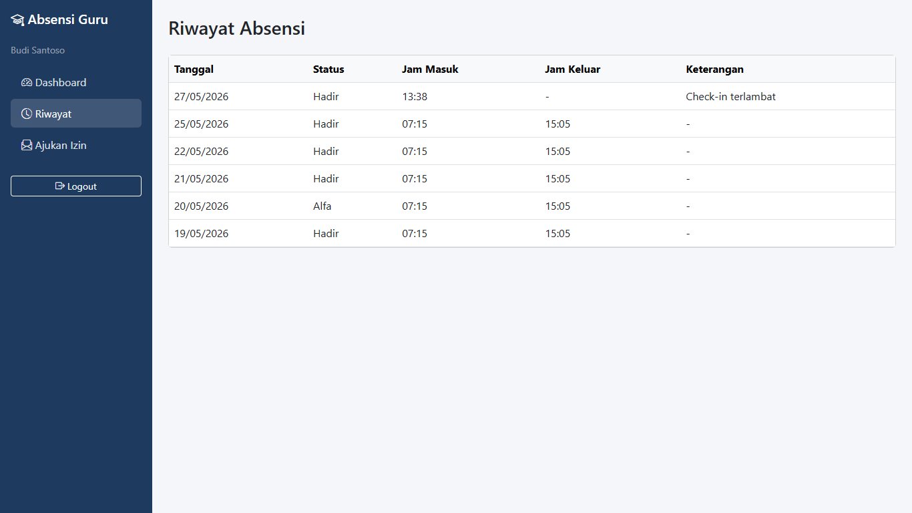
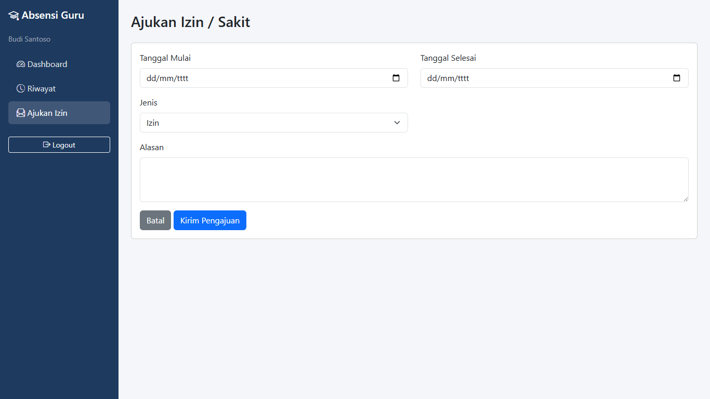

# Web Absensi Guru — Laravel 11

Aplikasi web untuk mencatat dan mengelola kehadiran guru di sekolah.

## Struktur Database

- `users` — autentikasi (role: admin/guru)
- `guru` — profil guru (NIP, mapel, kontak, foto)
- `absensi` — kehadiran harian (status, jam masuk/keluar)
- `pengajuan_izin` — izin/sakit dari guru
- `pengaturan` — profil sekolah, jam kerja

## Struktur Folder Utama

```
app/Http/Controllers/
  Admin/     → Dashboard, Guru, Absensi, Laporan, Pengaturan
  Guru/      → Dashboard, Absensi (check-in/out, izin)
  Auth/      → Login
app/Models/  → User, Guru, Absensi, Pengaturan, PengajuanIzin
resources/views/
  admin/     → Halaman admin
  guru/      → Halaman guru
  auth/      → Login
```

## Screenshot

### 1. Login page

awalan untuk web

<p align="center">
  
</p>

### 2. Role Admin

Role yang bertugas untuk mengawasi dan memanajemen data

#### 1. Dashboard (Admin)

<p align="center">
  
</p>

#### 2. Data Guru (Admin)

<p align="center">
  
</p>

#### 3. Absensi (Admin)

<p align="center">
  
</p>

#### 4. Laporan (Admin)

<p align="center">
  
</p>

#### 5. Pengajuan Izin (Admin)

<p align="center">
  
</p>

#### 6. Pengaturan (Admin)

<p align="center">
  
</p>

### 2. Role User / Guru

Role yang menggunakan web, bisa menambah data namun tidak memiliki akses yang lebih seperti menghapus atau mengubah data

#### 1. Dashboard (User)

<p align="center">
  
</p>

#### 2. Riwayat (User)

<p align="center">
  
</p>

#### 3. Pengajuan Izin (User)

<p align="center">
  
</p>


